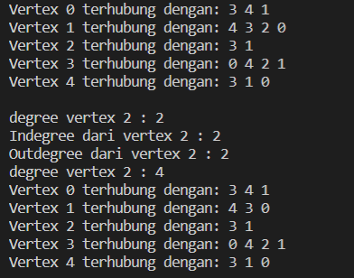
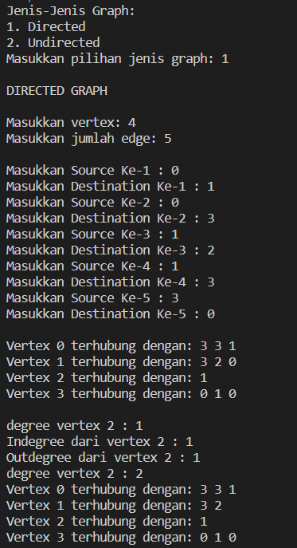
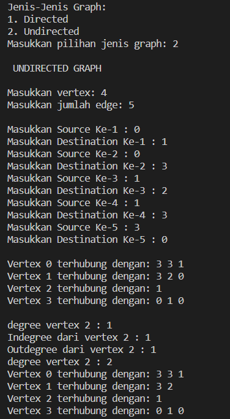
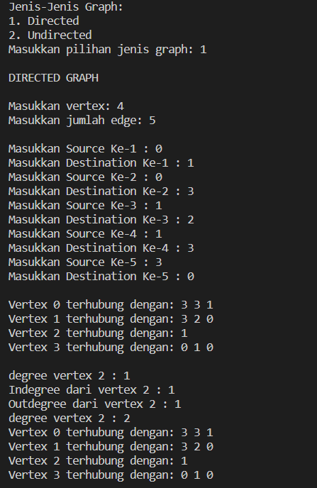
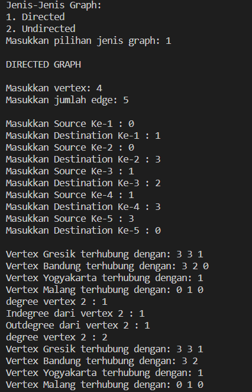

**Algoritma dan Struktur Data 2021-2022** 

**Nama : Andhito Galih Nur Cahyo**

**Kelas : 1F**

**No absen : 06**

**Nim : 2141720138**

**JOBSHEET XII**

**Graph**

**1.  Tujuan Praktikum** 
Setelah melakukan praktikum ini, mahasiswa mampu:
1. memahami model graph;
2. membuat dan mendeklarasikan struktur algoritma graph;
3. menerapkan algoritma dasar graph dalam beberapa studi kasus.

**2.Praktikum**

**2.1 Implementasi Graph menggunakan Linked List**

**2.1.1 Tahapan Percobaan**

### **2.1.2 Verifikasi Hasil Percobaan**



**2.1.3 Pertanyaan Percobaan**

1. Sebutkan beberapa jenis (minimal 3) algoritma yang menggunakan dasar Graph, dan apakah kegunaan algoritma-algoritma tersebut?
2. Pada class Graph terdapat array bertipe LinkedList, yaitu LinkedList list[]. Apakah tujuan  pembuatan variabel tersebut ? 
3. Apakah alasan pemanggilan method addFirst() untuk menambahkan data, bukan method add jenis lain pada linked list ketika digunakan pada method addEdge pada class Graph?
4. Bagaimana cara mendeteksi prev pointer pada saat akan melakukan penghapusan suatu edge pada graph ?
5. Kenapa pada praktikum 2.1.1 langkah ke-12 untuk menghapus path yang bukan merupakan lintasan pertama kali menghasilkan output yang salah ? Bagaimana solusinya ?

```
graph.removeEdge(1,3);
grap.printGraph();

```

**Jawab :**

1. 
  - **Algoritma Floyd**, untuk menentukan adanya jalur pada **Graph**

  - **Algoritma Brent**, untuk menentukan adanya jalur pada **Graph**

  - **Algoritma Hopcroft-Karp**, untuk penjodohan maksimum

  - **Algoritma Hungaria**, untuk penjodohan sempurna

2. Tujuannya ialah untuk memanggil method **Linkedlist** dan membuat objek bernama **list** yang gunanya untuk mengintansiasi list yang berupa vertex pada linked list tersebut.

3. alasan pemanggilan method **addFirst()** untuk menambahkan data, bukan method add jenis lain pada linked list ketika digunakan pada method addEdge pada **class Graph?** ialah untuk mengenalkan vertex tersebut dan koneksinya

4. Cara mendeteksi prev pointer pada saat akan melakukan penghapusan suatu edge pada graph, yakni ketika `i == destination`, maka akan dilihat source dari i. Jadi, jika vertex lebih besar dari **"i"** dan **destination** sama dengan **"i"**, maka edge akan secara otomatis dihapus.

5. yakni dengan mengubah isi dari vertex dan edges serta source dan destintion yang ada.

**2.2 Implementasi Graph menggunakan Matriks**

**2.2.1 Tahapan Percobaan**

**2.2.2 Verifikasi Hasil Percobaan**


**2.2.3 Pertanyaan Percobaan**

1. Apakah perbedaan degree/derajat pada directed dan undirected graph?
2. Pada implementasi graph menggunakan adjacency matriks. Kenapa jumlah vertices harus 
ditambahkan dengan 1 pada indeks array berikut?
3. Apakah kegunaan method getEdge() ?
4. Termasuk jenis graph apakah uji coba pada praktikum 2.2?
5. Mengapa pada method main harus menggunakan try-catch Exception ?

**Jawab :**

1. perbedaan degree/derajat pada directed dan undirected graph? adalah :

- jika directed `degreeIn` dan `degreeOut`nya berbeda, tetapi pada undirected graph? `degreeIn` dan `degreeOut`nya sama.

- Pada directed degree dapat mempengaruhi bobot pada edge antar vertex, misalnya pada X ke Y bobotnya 4, tetapi Y ke X bobotnya belum tentu sama 4. Sedangkan pada undirected graph? degree tidak dapat mempengaruhi bobot.

2. Karena indexnya dimulai dari 0, maka vertexnya perlu ditambahkan 1.

3. Kegunaan method getEdge() ialah untuk menampilkan suatu lintasan yang diperlukan.

4. Termasuk Directed Graph

5. Pada method main harus menggunakan *try-catch Exception* supaya dapat menangani error pada saat program dijalankan.

**3. Tugas Praktikum**

1.Ubahlah lintasan pada praktikum 2.1 menjadi inputan!

**Jawab:**

- code

```

package Tugas1;

public class Node{
    int data;
    Node prev, next;
    
    Node(Node prev, int data, Node next){
        this.prev = prev;
        this.data = data;
        this.next =  next;
    }
}

public class LinkedLists {
    Node head;
    int size;

    public LinkedLists(){
        head = null;
        size = 0;
    }

    public boolean isEmpty(){
        return head == null;
    }

    public void addFirst(int item){
        if(isEmpty()){
            head = new Node(null, item, null);
        }else{
            Node newNode = new Node(null, item, head);
            head.prev = newNode;
            head = newNode;
        }
        size++;
    }

    public void addLast(int item){
        if(isEmpty()){
            addFirst(item);
        }else{
            Node current = head;
            while (current.next != null){
                current = current.next;
            }
            Node newNode = new Node(current, item, null);
            current.next = newNode;
            size++;
        }
    }

    public void add(int item, int index) throws Exception{
        if(isEmpty()){
            addFirst(item);
        }else if (index < 0 || index > size){
            throw new Exception("Nilai index di luar batas");
        }else{
            Node current = head;
            int i = 0;
            while (i < index){
                current = current.next;
                i++;
            }
            if(current.prev == null){
                Node newNode = new Node(null, item, current);
                current.prev = newNode;
                head = newNode;
            }else{
                Node newNode = new Node(current.prev, item, current);
                newNode.prev = current.prev;
                newNode.next = current;
                current.prev.next = newNode;
                current.prev = newNode;
            }
        }
        size++;
    }

    public int size(){
        return size;
    }

    public void clear(){
        head = null;
        size = 0;
    }

    public void print(){
        if(!isEmpty()){
            Node tmp = head;
            while (tmp != null){
                System.out.print(tmp.data + "\t");
                tmp = tmp.next;
            }
            System.out.println("\nBerhasil Diisi");
        }else{
            System.out.println("Linked List Kosong");
        }
    }


    public void removeFirst() throws Exception {
        if (isEmpty()){
            throw new Exception("Linked List masih kosong, tidak dapat dihapus");
        }else if (size == 1){
            removeLast();
        }else{
            head = head.next;
            head.prev = null;
            size--;
        }
    }
    
    public void removeLast() throws Exception {
        if (isEmpty()){
            throw new Exception("Linked List masih kosong, tidak dapat dihapus");
        }else if (head.next == null){
            head = null;
            size--;
            return;
        }
        Node current = head;
        while (current.next.next != null){
            current = current.next;
        }
        current.next = null;
        size--;

    }

    public void remove(int index) throws Exception {
        if (isEmpty()){
            throw new Exception("Nilai index di luar batas");
        }else if (index == 0){
            removeFirst();
        }else{
            Node current = head;
            int i=0;
            while (i < index){
                current = current.next;
                i++;
            }
            if(current.next == null){
                current.prev.next = null;
            }else if (current.prev == null){
                current = current.next;
                current.prev = null;
                head = current;
            }else{
                current.prev.next = current.next;
                current.next.prev = current.prev;
            }
            size--;
        }
    }

    public int getFirst() throws Exception {
        if (isEmpty()){
            throw new Exception("Nilai index di luar batas");
        }
        return head.data;
    }
    
    public int getLast() throws Exception {
        if (isEmpty()){
            throw new Exception("Linked List Kosong");
        }
        Node tmp = head;
        while (tmp.next != null){
            tmp = tmp.next;
        }
        return tmp.data;
    }
    
    public int get(int index) throws Exception {
        if (isEmpty() || index >= size){
            throw new Exception("Nilai index di luar batas");
        }
        Node tmp = head;
        for(int i = 0; i < index; i++){
            tmp = tmp.next;
        }
        return tmp.data;
    }
}

public class T1Graph {
    int vertex;
    LinkedLists list[];

    public T1Graph(int vertex){
        this.vertex = vertex;
        list = new LinkedLists[vertex];
        for(int i=0; i<vertex; i++){
            list[i] = new LinkedLists();
        }
    }

    public void addEdge(int source, int destination){
        //add Edge
        list[source].addFirst(destination);
        //add back edge (for undirected)
        list[destination].addFirst(source);
    }

    public void degree(int source) throws Exception{
        //degree undirected graph
        System.out.println("degree vertex " + source + " : " + list[source].size());

        //degree directed graph
        //inDegree
        int k, totalIn = 0, totalOut = 0;
        for(int i=0; i<vertex; i++){
            for(int j=0; j<list[i].size(); j++){
                if(list[i].get(j) == source){
                    ++totalIn;
                }
            }
            //outDegree
            for(k=0; k<list[source].size(); k++){
                list[source].get(k);
            }
            totalOut = k;
        }
        System.out.println("Indegree dari vertex " + source + " : " + totalIn);
        System.out.println("Outdegree dari vertex " + source + " : " + totalOut);
        System.out.println("degree vertex " + source + " : " + (totalIn+totalOut));
    }

    public void removeEdge(int source, int destination) throws Exception{
        for(int i=0; i<vertex; i++){
            if(i == destination){
                list[source].remove(destination);
            }
        }
    }

    public void removeAllEdges(){
        for(int i=0; i<vertex; i++){
            list[i].clear();
        }
        System.out.println("Graph berhasil dikosongkan");
    }

    public void printGraph() throws Exception{
        for(int i=0; i<vertex; i++){
            if(list[i].size() > 0){
                System.out.print("Vertex " + i + " terhubung dengan: ");
                for(int j=0; j<list[i].size(); j++){
                    System.out.print(list[i].get(j) + " ");
                }
                System.out.println("");
            }
        }
        System.out.println(" ");
    }
}

import java.util.Scanner;

public class T1GraphMain {
    public static void main(String[] args) throws Exception {
        Scanner input = new Scanner(System.in);
        System.out.print("Masukkan vertex: ");
        int vertex = input.nextInt();
        T1Graph graph = new T1Graph(vertex);

        System.out.print("Masukkan jumlah edges: ");
        int edge = input.nextInt();

        for(int i=0; i<edge; i++){
            System.out.print("Masukkan Source Ke-" + (i+1) + " : ");
            int source = input.nextInt();
            System.out.print("Masukkan Destination Ke-" + (i+1) + " : ");
            int dest = input.nextInt();
            
            graph.addEdge(source, dest);
        }
        System.out.println();
        graph.printGraph();

        graph.degree(2);
        graph.removeEdge(1, 2);
        graph.printGraph();
        // graph.addEdge(0, 1);
        // graph.addEdge(0, 4);
        // graph.addEdge(1, 2);
        // graph.addEdge(1, 3);
        // graph.addEdge(1, 4);
        // graph.addEdge(2, 3);
        // graph.addEdge(3, 4);
        // graph.addEdge(3, 0);
        // graph.printGraph();
        // graph.degree(2);
        
        // graph.removeEdge(1, 2);
        // graph.printGraph();
    }
}

```
- Output:


2.Tambahkan method **graphType** dengan tipe boolean yang akan membedakan *graph* termasuk *directed* atau *undirectedgraph*. Kemudian update seluruh method yang berelasi dengan method **graphType** tersebut (hanya menjalankan statement sesuai dengan jenis graph) pada praktikum 2.1

- Code

```
package Tugas2;

public class Node{
    int data;
    Node prev, next;
    
    Node(Node prev, int data, Node next){
        this.prev = prev;
        this.data = data;
        this.next =  next;
    }
}

public class LinkedLists {
    Node head;
    int size;

    public LinkedLists(){
        head = null;
        size = 0;
    }

    public boolean isEmpty(){
        return head == null;
    }

    public void addFirst(int item){
        if(isEmpty()){
            head = new Node(null, item, null);
        }else{
            Node newNode = new Node(null, item, head);
            head.prev = newNode;
            head = newNode;
        }
        size++;
    }

    public void addLast(int item){
        if(isEmpty()){
            addFirst(item);
        }else{
            Node current = head;
            while (current.next != null){
                current = current.next;
            }
            Node newNode = new Node(current, item, null);
            current.next = newNode;
            size++;
        }
    }

    public void add(int item, int index) throws Exception{
        if(isEmpty()){
            addFirst(item);
        }else if (index < 0 || index > size){
            throw new Exception("Nilai index di luar batas");
        }else{
            Node current = head;
            int i = 0;
            while (i < index){
                current = current.next;
                i++;
            }
            if(current.prev == null){
                Node newNode = new Node(null, item, current);
                current.prev = newNode;
                head = newNode;
            }else{
                Node newNode = new Node(current.prev, item, current);
                newNode.prev = current.prev;
                newNode.next = current;
                current.prev.next = newNode;
                current.prev = newNode;
            }
        }
        size++;
    }

    public int size(){
        return size;
    }

    public void clear(){
        head = null;
        size = 0;
    }

    public void print(){
        if(!isEmpty()){
            Node tmp = head;
            while (tmp != null){
                System.out.print(tmp.data + "\t");
                tmp = tmp.next;
            }
            System.out.println("\nBerhasil Diisi");
        }else{
            System.out.println("Linked List Kosong");
        }
    }


    public void removeFirst() throws Exception {
        if (isEmpty()){
            throw new Exception("Linked List masih kosong, tidak dapat dihapus");
        }else if (size == 1){
            removeLast();
        }else{
            head = head.next;
            head.prev = null;
            size--;
        }
    }
    
    public void removeLast() throws Exception {
        if (isEmpty()){
            throw new Exception("Linked List masih kosong, tidak dapat dihapus");
        }else if (head.next == null){
            head = null;
            size--;
            return;
        }
        Node current = head;
        while (current.next.next != null){
            current = current.next;
        }
        current.next = null;
        size--;

    }

    public void remove(int index) throws Exception {
        if (isEmpty()){
            throw new Exception("Nilai index di luar batas");
        }else if (index == 0){
            removeFirst();
        }else{
            Node current = head;
            int i=0;
            while (i < index){
                current = current.next;
                i++;
            }
            if(current.next == null){
                current.prev.next = null;
            }else if (current.prev == null){
                current = current.next;
                current.prev = null;
                head = current;
            }else{
                current.prev.next = current.next;
                current.next.prev = current.prev;
            }
            size--;
        }
    }

    public int getFirst() throws Exception {
        if (isEmpty()){
            throw new Exception("Nilai index di luar batas");
        }
        return head.data;
    }
    
    public int getLast() throws Exception {
        if (isEmpty()){
            throw new Exception("Linked List Kosong");
        }
        Node tmp = head;
        while (tmp.next != null){
            tmp = tmp.next;
        }
        return tmp.data;
    }
    
    public int get(int index) throws Exception {
        if (isEmpty() || index >= size){
            throw new Exception("Nilai index di luar batas");
        }
        Node tmp = head;
        for(int i = 0; i < index; i++){
            tmp = tmp.next;
        }
        return tmp.data;
    }
}

public class T2Graph {
    int vertex;
    LinkedLists list[];

    public T2Graph(int vertex){
        this.vertex = vertex;
        list = new LinkedLists[vertex];
        for(int i=0; i<vertex; i++){
            list[i] = new LinkedLists();
        }
    }

    public void addEdge(int source, int destination){
        //add Edge
        list[source].addFirst(destination);
        //add back edge (for undirected)
        list[destination].addFirst(source);
    }

    public void degree(int source) throws Exception{
        //degree undirected graph
        System.out.println("degree vertex " + source + " : " + list[source].size());

        //degree directed graph
        //inDegree
        int k, totalIn = 0, totalOut = 0;
        for(int i=0; i<vertex; i++){
            for(int j=0; j<list[i].size(); j++){
                if(list[i].get(j) == source){
                    ++totalIn;
                }
            }
            //outDegree
            for(k=0; k<list[source].size(); k++){
                list[source].get(k);
            }
            totalOut = k;
        }
        System.out.println("Indegree dari vertex " + source + " : " + totalIn);
        System.out.println("Outdegree dari vertex " + source + " : " + totalOut);
        System.out.println("degree vertex " + source + " : " + (totalIn+totalOut));
    }

    public void removeEdge(int source, int destination) throws Exception{
        for(int i=0; i<vertex; i++){
            if(i == destination){
                list[source].remove(destination);
            }
        }
    }

    public void removeAllEdges(){
        for(int i=0; i<vertex; i++){
            list[i].clear();
        }
        System.out.println("Graph berhasil dikosongkan");
    }
    
    
    public void printGraph() throws Exception{
        for(int i=0; i<vertex; i++){
            if(list[i].size() > 0){
                System.out.print("Vertex " + i + " terhubung dengan: ");
                for(int j=0; j<list[i].size(); j++){
                    System.out.print(list[i].get(j) + " ");
                }
                System.out.println("");
            }
        }
        System.out.println(" ");
    }

    // Tugas Nomor 2
    public boolean graphType(boolean pilih){
        return pilih;
    }
}

import java.util.Scanner;

public class T2GraphMain {
    public static void main(String[] args) throws Exception {
        Scanner input = new Scanner(System.in);
        boolean type;
        int pil;
        char ulang;
        do {
            System.out.println("Jenis-Jenis Graph: ");
            System.out.println("1. Directed ");
            System.out.println("2. Undirected ");
            System.out.print("Masukkan pilihan jenis graph: ");
            pil =  input.nextInt();
            do {
                switch(pil){
                    case 1:
                        System.out.println("\nDIRECTED GRAPH");
                        type = true;
                        break;
                    case 2:
                        System.out.println("\n UNDIRECTED GRAPH");
                        type = false;
                        break;
                    default:
                        System.out.println("Inputan Anda Salah!");
                        System.exit(0);
                        break;
                }
        
                System.out.println();
                System.out.print("Masukkan vertex: ");
                int vertex = input.nextInt();
                T2Graph graph = new T2Graph(vertex);
                System.out.print("Masukkan jumlah edge: ");
                int edge = input.nextInt();
                System.out.println();
                for(int i=0; i<edge; i++){
                    System.out.print("Masukkan Source Ke-" + (i+1) + " : ");
                    int source = input.nextInt();
                    System.out.print("Masukkan Destination Ke-" + (i+1) + " : ");
                    int dest = input.nextInt();
                    
                    graph.addEdge(source, dest);
                }
                System.out.println();
                graph.printGraph();
        
                graph.degree(2);
                graph.removeEdge(1, 2);
                graph.printGraph();
            } while (pil == 1 && pil == 2);
                System.out.print("Apakah ingin kembali ke menu jenis graph (Y/N): ");
                ulang = input.next().charAt(0);
                System.out.println();

        } while (ulang == 'y' || ulang == 'Y');
          System.out.println("TERIMA KASIH...");
    //     Graph graph = new Graph(6);
    //     graph.addEdge(0, 1);
    //     graph.addEdge(0, 4);
    //     graph.addEdge(1, 2);
    //     graph.addEdge(1, 3);
    //     graph.addEdge(1, 4);
    //     graph.addEdge(2, 3);
    //     graph.addEdge(3, 4);
    //     graph.addEdge(3, 0);
    //     graph.printGraph();
    //     graph.degree(2);
        
    //     graph.removeEdge(1, 2);
    //     graph.printGraph();
    }
}

```
- Output :





3.Modifikasi method **removeEdge()** pada praktikum 2.1 agar tidak menghasilkan output yang salah untuk path selain path pertama kali!

**Jawab:**

- Code:

```
    public void removeEdge(int source, int destination) throws Exception{
        for(int i=0; i<vertex; i++){
            if(i == destination){
                list[source].remove(destination);
            }
        }
    }

```
- Output:



4.Ubahlah tipe data *vertex* pada seluruh graph pada praktikum 2.1 dan 2.2 dari Integer menjadi tipe generic agar dapat menerima semua tipe data dasar Java! Misalnya setiap *vertex* yang awalnya berupa angka 0,1,2,3, dst. selanjutnya ubah menjadi suatu nama daerah seperti Gresik, Bandung, Yogya, Malang, dst.

**Jawab:**

- Code:

```
    public void printGraph() throws Exception{
        String kota = "";
        for(int i=0; i<vertex; i++){
            if(list[i].size() > 0){
                if ( i == 0){
                    kota = "Gresik";
                } else if (i == 1){
                    kota = "Bandung";
                } else if (i == 2){
                    kota = "Yogyakarta";
                } else if (i == 3){
                    kota = "Malang";
                } else if (i == 4){
                    kota = "Surabaya";
                } else {
                    kota = "Denpasar";
                }
                System.out.print("Vertex " + kota + " terhubung dengan: ");
                for(int j=0; j<list[i].size(); j++){
                    System.out.print(list[i].get(j) + " ");
                }
                System.out.println("");
            }
        }
    }

```   
- Output:


